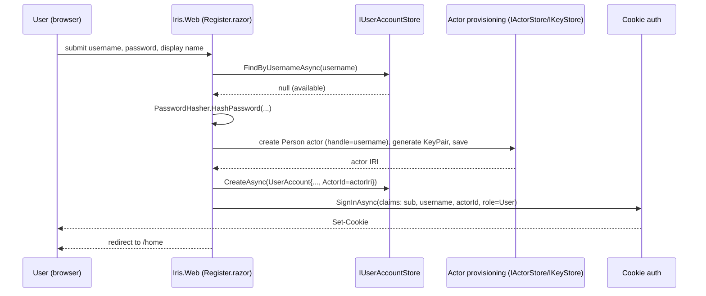
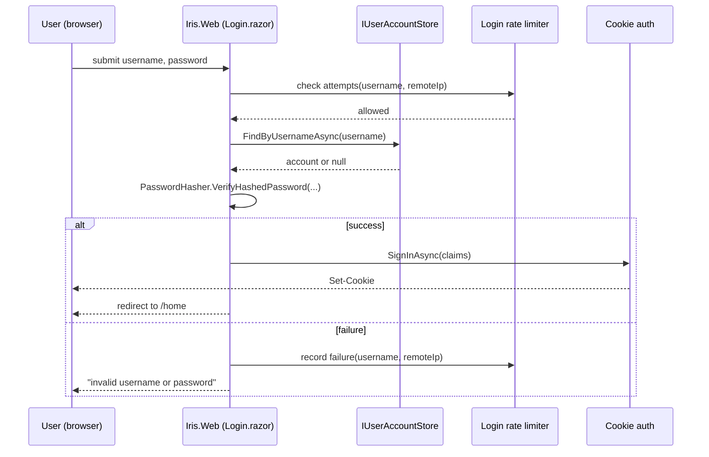

# Production App — Authentication Flows & Data Model

> **Level 3.** Parent: [production-app-authentication.md](production-app-authentication.md). Grandparent: [production-app-overview.md](production-app-overview.md).

## 1. Data model

```csharp
public sealed class UserAccount
{
    public Guid Id { get; set; }
    public required string Username { get; set; }     // unique, case-insensitive comparison
    public required string PasswordHash { get; set; }  // PasswordHasher<UserAccount>-produced
    public UserRole Role { get; set; }                 // User | Admin
    public required Iri ActorId { get; set; }           // FK to the linked local actor
    public DateTimeOffset? NotificationsReadAt { get; set; } // MVP "mark as read" cursor, see production-app-feature-set.md §2
    public DateTimeOffset CreatedAt { get; set; }
}

public enum UserRole { User, Admin }
```

`IUserAccountStore` (new interface, declared **and** implemented in `Iris.Server.Data` — see [production-app-authentication.md](production-app-authentication.md) §5 for why this one interface breaks from the usual "interface in `Iris.Server`, implementation in the persistence project" pattern — per [production-app-persistence-schema.md](production-app-persistence-schema.md)):

```csharp
public interface IUserAccountStore
{
    Task<UserAccount?> FindByUsernameAsync(string username, CancellationToken ct = default);
    Task<UserAccount?> FindByIdAsync(Guid id, CancellationToken ct = default);
    Task CreateAsync(UserAccount account, CancellationToken ct = default);
    Task UpdatePasswordHashAsync(Guid id, string newHash, CancellationToken ct = default); // also the admin-assisted reset path, §7
    Task UpdateNotificationsReadAtAsync(Guid id, DateTimeOffset readAt, CancellationToken ct = default);
    Task<bool> AnyAdminExistsAsync(CancellationToken ct = default); // for AdminBootstrapper
}
```

## 2. Password hashing

Use `Microsoft.AspNetCore.Identity.PasswordHasher<UserAccount>` (available standalone from the `Microsoft.AspNetCore.Identity` package without adopting the rest of ASP.NET Core Identity — it has no dependency on `UserManager`/its own `DbContext`). It defaults to PBKDF2-HMAC-SHA256 with a per-password salt and a versioned hash format, so a future algorithm upgrade re-hashes transparently on next login (`VerifyHashedPassword` returns `SuccessRehashNeeded` — handle that by re-hashing and saving). Do not hand-roll PBKDF2/bcrypt/argon2 wiring.

## 3. Registration sequence



## 4. Login sequence



## 5. Claims schema

| Claim | Value |
|---|---|
| `ClaimTypes.NameIdentifier` | `UserAccount.Id` (Guid) |
| `ClaimTypes.Name` | `UserAccount.Username` |
| `"actor_iri"` (custom) | `UserAccount.ActorId.Value` |
| `ClaimTypes.Role` | `UserAccount.Role.ToString()` |

`IActorSessionAccessor` ([production-app-web-host.md](production-app-web-host.md) §3) reads `"actor_iri"` to resolve the signing key via `IKeyStore`.

## 6. Rate limiting

Reuse the *shape* of the existing `Iris.Server.Security.SlidingWindowInboundRateLimiter` (a sliding-window counter keyed by an identity string) as a model for a login-attempt limiter keyed by `username + remote IP` — a new, small component in `Iris.Web`, not a change to the library's inbound-federation rate limiter (that one gates federation traffic; this one gates login attempts, a different concern with a different key shape and a much lower threshold, e.g. 5 attempts / 15 minutes).

## 7. Admin bootstrap (`AdminBootstrapper`)

An `IHostedService.StartAsync` that runs once at startup:

```csharp
if (await _users.AnyAdminExistsAsync(ct)) return; // idempotent — never overwrites an existing admin
var username = _config["App:Admin:Username"];
var password = _config["App:Admin:Password"];
if (string.IsNullOrEmpty(username) || string.IsNullOrEmpty(password)) return; // no bootstrap configured
// same provisioning path as registration, with Role = Admin
```

Document in [production-app-deployment.md](production-app-deployment.md) that these two variables should be **unset (or rotated out of `.env`) after the first successful startup** in a real deployment, since they remain readable in the environment otherwise.

## 8. Phase 2: proving out OAuth2

Once the above ships, add an integration test suite that drives the existing (untested) OAuth2 endpoints end-to-end:

1. `GET /ap/v1/oauth2/authorize?client_id=iris-web&redirect_uri=...&state=...` while signed in via cookie → expect a 302 with `?code=...&state=...`.
2. `POST /ap/v1/oauth2/token` with that code → expect a bearer token back.
3. Use the bearer token to call an owner-gated endpoint (e.g., the inbox read) → expect success.
4. `POST /ap/v1/oauth2/revoke` the token → expect the subsequent call to fail.

If this passes cleanly, `IActorSessionAccessor` can be switched to mint/cache a bearer token through this flow instead of reading `IKeyStore` directly — a config-flag-gated change, not a rewrite (see [production-app-web-host.md](production-app-web-host.md) §3).

## 9. Phase 3: external IdP login (sketch, not built in the MVP)

- New `ExternalLogin` entity: `Provider` (e.g. `"Google"`), `ProviderUserId`, `UserAccountId` (FK).
- `AddAuthentication().AddGoogle(...)` (or the relevant provider package) alongside the existing cookie scheme.
- Callback handler: if a matching `ExternalLogin` row exists, sign in as that linked account; otherwise, if the browser is already signed in (linking flow) create the row; otherwise, prompt to register (which then also creates the `ExternalLogin` row pointing at the new account).
