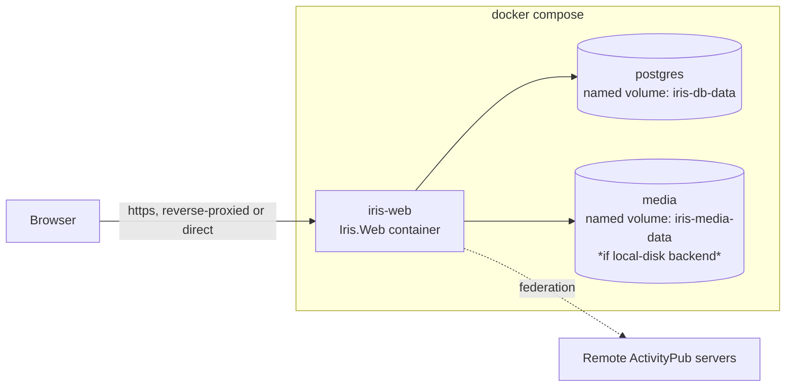

# Production App — Deployment

> **Level 2.** Parent: [production-app-overview.md](production-app-overview.md). Child: [production-app-deployment-env-reference.md](production-app-deployment-env-reference.md).

## 1. Relationship to the existing `docker-compose.yml`

The repository has a `docker-compose.yml` that is the **library's** cross-container federation test harness (`iris-a` + `iris-b` + `iris-ui`: two in-memory/file-backed `SampleServer` instances + the WASM explorer) — it is not this workstream's concern functionally, but it currently sits at the repo root and its `iris-ui` service publishes host port `8088`, which the production app needs (see [production-app-overview.md](production-app-overview.md) §2, the public `https://iris.luit.ink` reverse proxy already forwards to `8088`). **As an initial-prep step for this phase** (before any new code — see [production-app-overview.md](production-app-overview.md) §6 step 0), that file is relocated to `samples/docker-compose.yml` (it's a sample-only artifact and belongs there), its two services' `build.context` changes from `.` to `..`, and its `iris-ui` service drops the now-conflicting `8088:8090` mapping (keeping only `8090:8090` for local use). This relocation **must** bring the running sample stack down first (`docker compose down --remove-orphans` from its old location) — do not move the file out from under running containers. This ordering is deliberately left for the actual implementation turn to execute, not done ahead of time, since the containers in question are long-running and shouldn't be torn down speculatively during planning.

This workstream adds a **new, separate** Compose file for the production app — e.g. `apps/Iris.Web/docker-compose.yml` (do not merge it into `samples/docker-compose.yml`; the two stacks serve different purposes and shouldn't share a network namespace by default). The production app's `iris-web` service publishes host port **`8088`** (not an arbitrary port) so it takes over the existing `iris.luit.ink` reverse-proxy target the sample stack currently (and temporarily) occupies.

**Gap between prep and go-live:** once the initial-prep step drops the sample's `8088:8090` mapping, nothing serves `https://iris.luit.ink` until *this* workstream's Compose stack actually goes live — see the callout in [production-app-overview.md](production-app-overview.md) §6 step 0 for the accepted tradeoff (and the escape hatch of a temporary placeholder) if that gap turns out to be longer than acceptable.

## 2. Stack shape

Services:

| Service | Image/build | Notes |
|---|---|---|
| `iris-web` | Built from `apps/Iris.Web/Dockerfile` | The single app container (API + UI). Configured entirely via env vars (`Iris:*`, `ConnectionStrings:*`, `App:*` — see the env reference doc). |
| `db` | `postgres:16` (or newer LTS at implementation time) | Named volume for `PGDATA`. Health-checked (`pg_isready`) so `iris-web` waits for it to be ready (`depends_on: condition: service_healthy`). |
| `media` *(optional, only if the MinIO/S3 backend is chosen instead of local disk)* | `minio/minio` | Named volume for object storage; only needed if [production-app-media-storage.md](production-app-media-storage.md)'s S3-compatible backend is enabled. The MVP can ship with the local-disk backend and skip this service entirely — add it as a profile (`docker compose --profile s3 up`) rather than a hard requirement. |

## 3. Volumes

- `iris-db-data` — PostgreSQL data directory. This is the single most important volume: losing it loses every account, actor, post, and relationship.
- `iris-media-data` — uploaded media (only relevant for the local-disk media backend).
- No named volume is needed for the app container itself — it should be stateless (all state in the DB + media volume), so `docker compose down` (without `-v`) + `up` recreates a clean container with no data loss, and `down -v` gives a full reset — matching the convention already documented in `samples/docker-compose.yml`.

## 4. `.env` configuration

Follow the existing convention (see the root `docker-compose.yml`'s `${VAR:-default}` pattern): every tunable is an environment variable with a sensible default, documented in a committed `.env.example`, with the real `.env` git-ignored. Categories of variables (full list + descriptions in [production-app-deployment-env-reference.md](production-app-deployment-env-reference.md)):

- **Instance identity** — advertised hostname/port/https, instance name, namespace IRI (mirrors `Iris__HostName`/`Iris__AdvertiseHost`/etc. already used by `SampleServer`).
- **Database** — Postgres user/password/database name, connection string assembly.
- **Media** — backend selection (local vs S3), and the S3/MinIO credentials + bucket when applicable.
- **Admin bootstrap** — `IRIS_ADMIN_USERNAME` / `IRIS_ADMIN_PASSWORD` (see [production-app-authentication.md](production-app-authentication.md) §6).
- **CORS** — only relevant if something other than the app's own UI calls the API cross-origin (e.g., a future mobile client); default to same-origin only.

## 5. TLS / reverse proxy

Out of scope for the MVP Compose stack itself (matching the existing sample's approach — it documents a public-FQDN + reverse-proxy path as a *deferred* concern in [docs/plans/phase-22-closeout.md](phase-22-closeout.md), not something the Compose file itself provisions). For the production app:

- Ship the MVP listening on plain HTTP inside the container, published on a host port, with a note (in the env reference doc) that a real deployment sits it behind a TLS-terminating reverse proxy (Caddy, Traefik, nginx) — same pattern the root Compose file uses for `iris.luit.ink`.
- A minimal example reverse-proxy config (e.g., a `Caddyfile` snippet) belongs in [production-app-deployment-env-reference.md](production-app-deployment-env-reference.md) as a documented appendix, not as a required Compose service.
- **This app needs two things `SampleServer` never had to worry about behind a TLS-terminating proxy, precisely because this app (not the sample) has cookie auth and an interactive SignalR circuit ([production-app-web-host.md](production-app-web-host.md) §2):**
  1. **Forwarded headers.** Wire `app.UseForwardedHeaders(...)` (`Microsoft.AspNetCore.HttpOverrides`, trusting `X-Forwarded-Proto`/`X-Forwarded-For` from the reverse proxy) *before* `UseAuthentication()`/`UseAuthorization()` in `Program.cs` — without it, the app sees plain `http` even though the real client connection is `https`, which breaks the auth cookie's `Secure` flag and any scheme-dependent redirect.
  2. **WebSocket upgrade support in the proxy config.** The Blazor Interactive Server circuit is a long-lived WebSocket connection; Caddy proxies WebSocket upgrades transparently by default (the example config in [production-app-deployment-env-reference.md](production-app-deployment-env-reference.md) §3 needs no extra directive), but a different reverse proxy (nginx, an older Traefik config) may need an explicit `Upgrade`/`Connection` header pass-through — call this out if the eventual deployment doesn't use Caddy.

## 6. What "done" looks like for this workstream

- `docker compose up --build` from a clean checkout (empty volumes) produces a running app reachable on a published port, with the admin account bootstrapped from `.env`.
- `docker compose down` (no `-v`) followed by `up` preserves all data.
- `docker compose down -v` followed by `up` produces a genuinely clean slate (no orphaned data, no stale admin account confusion).
- A smoke-test script analogous to the existing [scripts/docker-smoke-test.sh](../../scripts/docker-smoke-test.sh) exists for the new stack (register a user, post a note, confirm it's readable, restart the stack, confirm it's still there).

See [production-app-deployment-env-reference.md](production-app-deployment-env-reference.md) for the full variable list and an example reverse-proxy config.
