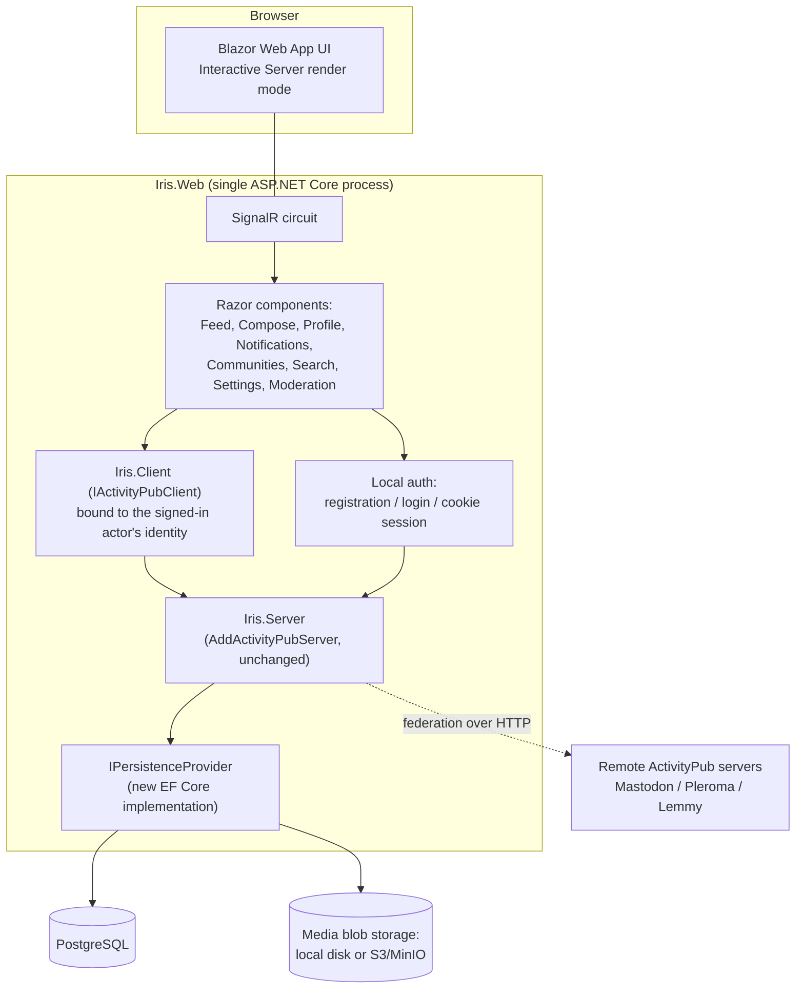
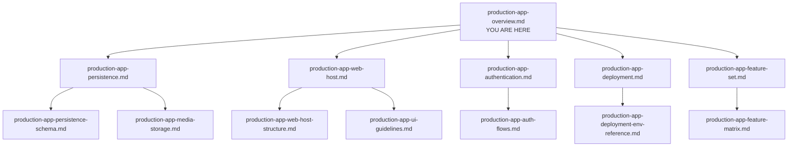

# Iris Production App — Overview & MVP Plan

> **Level 1 of 3.** This is the top-level plan for building **the production social platform app** on top of the Iris ActivityPub libraries. Read this document first; it links to Level 2 (per-workstream) documents, which in turn link to Level 3 (deep-dive) documents where the detail gets implementation-specific. An autonomous agent should read this file fully, then open only the child documents relevant to the slice it is currently building.
>
> This plan is **not** part of the [PLAN.md](../../PLAN.md) autonomous loop's current active phase (Phase 30/31, library hardening). It is the scope document for the **next major initiative**: a real, deployable, self-hosted social platform. When the loop is ready to start this work, it becomes a new phase in [ROADMAP.md](../ROADMAP.md) and PLAN.md's "Now"/"Active Slice" sections point back at this tree. Until then, this tree is the durable plan — safe to read, reference, and refine across many turns.

## 1. Vision

Iris today is a set of libraries (`Iris.Core`, `Iris.Client`, `Iris.Server`, `Iris.Server.InMemory`, `Iris.WebCrypto`) plus **sample** apps (`SampleServer`, `SampleBlazorClient`, `IrisStaticHost`) that exist to exercise and demonstrate the libraries. They are deliberately minimal — an "explorer," not a product.

This plan builds the **first real product**: a single Blazor application — codename **Iris.Web** — that is simultaneously:

1. A full ActivityPub server (via `Iris.Server`, unchanged), federating with Mastodon/Pleroma/Lemmy/etc.
2. A production-grade persistence backend (durable, queryable, backup-able — not the in-memory or dev-grade file-backed stores).
3. A polished, functional social platform UI: registration, timeline, compose, communities, notifications, moderation, search — everything a user expects from a Mastodon/Lemmy-like service.
4. A single deployable unit: one Docker Compose stack, `.env`-configured, with real volumes for data and media.

**Nothing about `Iris.Core`/`Iris.Client`/`Iris.Server`'s public contracts changes.** This is an app built *on* the libraries, the same way `SampleServer` is — just with a production persistence provider instead of in-memory/file-backed, and a real UI instead of an explorer. The existing samples are untouched and keep serving their purpose (library smoke-testing, cross-instance federation testing, manual review).

## 2. Public hosting target

The app will be reachable at **https://iris.luit.ink** — a reverse proxy for that domain already exists and forwards to this host's port `8088` (today it forwards to the sample explorer's `iris-ui` service, purely because that was the first thing that claimed the port; see [production-app-deployment.md](production-app-deployment.md) §1). The production compose stack should publish `Iris.Web` on host port `8088` so it takes over that existing reverse-proxy target with no reverse-proxy reconfiguration needed. This is a real constraint on the deployment doc, not just a nice-to-have default — keep `8088` as the published port for `iris-web` rather than picking an arbitrary one.

## 3. Non-negotiable constraints (carried from the user's brief)

- **AP-native interfaces only.** The server/API layer must never be specialized to a persistence technology. Every new persistence implementation is a drop-in for the *existing* `Iris.Server` store interfaces (`IActorStore`, `IActivityStore`, `IFollowStore`, `ILikeStore`, `IAnnounceStore`, `IReplyStore`, `IModerationStore`, `IRelayStore`, `IObjectStore`, `ICreateIndex`, `ICommunityStore`, `IKeyStore`, `IMediaStore`, bundled behind `IPersistenceProvider`) — see [`Iris.Server/Stores`](../../src/Iris.Server/Stores) and the existing `Iris.Server.InMemory` / file-backed (`Iris.Server/Persistance`) implementations for the contract to match. If a feature needs a new query shape, the interface grows a method; the *server/handler* code never reaches around the interface into a concrete database type.
- **`IActivityPubClient` is the only interaction surface between `Iris.Web`'s UI and `Iris.Server` — we are not building new APIs.** Every screen's every action (post, follow, like, moderate, search, upload media, adjust relays/settings, admin actions) goes through `Iris.Client` calling `Iris.Server`'s existing `/ap/v1/...` (AP-native) and `/local/v1/...` (AP-adjacent, Basic-authenticated) routes — the same surface a real federated peer or any other ActivityPub client would use. If a screen needs a capability the client doesn't expose yet, the fix is **adding a method to `Iris.Client`** (backed by an existing or newly added `Iris.Server` endpoint) — never a bespoke Razor Pages/MVC controller, a SignalR hub method, or a direct EF Core query built just for `Iris.Web`. The one deliberate exception is local username/password registration/login itself ([production-app-authentication.md](production-app-authentication.md)) — ActivityPub defines no browser-session-auth handshake, so that specific boundary is inherently local; everything *inside* an authenticated session is client-mediated. See [production-app-web-host.md](production-app-web-host.md) §3 for how this is wired.
- **Media storage is part of persistence**, not bolted on separately — `IMediaStore` already exists; production just needs a real backing implementation.
- **Auth starts simple.** Local username/password registration is the MVP bootstrap mechanism. The server already has OAuth2 (RFC 6749) endpoints and Basic/Bearer credential validators — largely unexercised — which become the natural next step (and a good excuse to finally test them), with external IdP login (Google, etc.) as a later phase.
- **One Docker Compose stack**, `.env`-driven, with named volumes for the database and media.
- **Broad MVP, then iterate.** Every workstream below is scoped as: get it *working* end-to-end first (functionality), then make it *pleasant* to use (experience), then make it *look good* (polish). Don't gold-plate the first pass.

## 4. Architecture snapshot

One process, one database, one media store, one Compose stack. No cross-origin API/UI split (that split exists in the *samples* for a reason — the WASM explorer talks to servers it doesn't own — but a production single-tenant app doesn't need it).

## 5. The four foundational workstreams

Each has its own Level 2 document. Read the one you're about to implement; skim the others for context.

| # | Workstream | Delivers | Doc |
|---|---|---|---|
| 1 | **Persistence & media** | A production `IPersistenceProvider` (EF Core + PostgreSQL, recommended) and a production `IMediaStore` (local disk + optional S3/MinIO backend), replacing in-memory/file-backed for this app. | [production-app-persistence.md](production-app-persistence.md) |
| 2 | **Web host project** | The `Iris.Web` Blazor Web App itself: project layout, hosting model, render mode, how UI components talk to the ActivityPub server/client living in the same process. | [production-app-web-host.md](production-app-web-host.md) |
| 3 | **Authentication** | Local username/password registration + login, mapped to a provisioned local Actor; a path to test/adopt the existing OAuth2 support; a later path to external IdP login. | [production-app-authentication.md](production-app-authentication.md) |
| 4 | **Deployment** | The production `docker-compose.yml` (app + database + media volume), `.env` template, and operational notes. | [production-app-deployment.md](production-app-deployment.md) |

A fifth document ties them together into the actual **product surface** — the screens and features a user sees, phased from "works" to "pleasant" to "polished":

| # | Workstream | Delivers | Doc |
|---|---|---|---|
| 5 | **Feature set & UX** | The full functional scope of the social platform (timeline, compose, communities, notifications, moderation, search, settings), phased across three passes (functionality → experience → polish), mapped against what the libraries already support and what small library gaps need closing. | [production-app-feature-set.md](production-app-feature-set.md) |

## 6. Suggested build order (for the autonomous loop)

This is a *suggestion*, not a hard gate — but building in dependency order avoids rework:

0. **Initial prep (do this first, before any new code).** The existing root `docker-compose.yml` is the *library's* sample federation-test stack (`iris-a`/`iris-b`/`iris-ui`) — it doesn't belong at the repo root once a real app exists, and its `iris-ui` service currently squats on host port 8088 (the port the production app needs for `iris.luit.ink`, see §2). Relocate it: **(a)** bring down the running sample stack (`docker compose -f docker-compose.yml down --remove-orphans`) — do not skip this, moving the file while containers reference the old path/project leaves orphaned containers; **(b)** `git mv docker-compose.yml samples/docker-compose.yml`; **(c)** fix the two services' `build.context` from `.` to `..` (the file moved one directory deeper, but the Dockerfiles still need repo-root context); **(d)** drop the `8088:8090` port mapping from the sample's `iris-ui` service (only keep `8090:8090` for local smoke-testing — `8088` is now the production app's) and update its stale comment; **(e)** update `scripts/docker-smoke-test.sh`'s `COMPOSE_FILE` path and [docs/reference/DEPLOYMENT.md](../reference/DEPLOYMENT.md)'s command examples to `samples/docker-compose.yml`; **(f)** bring the sample stack back up from its new location and re-run `./scripts/docker-smoke-test.sh` to confirm nothing broke. This was intentionally *not* done during planning — the containers currently running are shared/long-lived and shouldn't be torn down outside of an actual implementation turn.

   **Consequence worth calling out explicitly:** step (d) means `https://iris.luit.ink`'s reverse proxy has nothing listening on host port 8088 from this point until step 5 (Deployment) below actually stands up `iris-web` published on that port — a gap that could span many turns/days of build time on steps 1–4. This is an accepted, deliberate tradeoff (there's no real traffic/users on that URL yet to disappoint), but it should be a conscious choice, not a surprise discovered later: **(g)** confirm this tradeoff explicitly at the start of the implementation turn (or, if an outage of that duration isn't acceptable, restore a minimal placeholder — even just the relocated `samples/docker-compose.yml`'s `iris-ui` service temporarily re-published on 8088 — until step 5's real stack is ready to take over). Record whichever choice is made in the [decisions log](#9-decisions-log-fill-in-as-the-agent-resolves-open-questions).
1. **Foundation.** Stand up `Iris.Web` as a bare Blazor Web App that boots `Iris.Server` with the **existing in-memory persistence** (fastest path to "it runs"). Confirm the existing library's endpoints work inside the new host (WebFinger, actor doc, inbox/outbox) before touching persistence or auth. → [production-app-web-host.md](production-app-web-host.md)
2. **Persistence.** Swap in-memory for the new EF Core provider. Prove durability (restart the container, data survives) before building any UI against it. → [production-app-persistence.md](production-app-persistence.md)
3. **Auth.** Add registration/login, provisioning a local actor per account. This unlocks "a real user can sign up and get an ActivityPub identity." → [production-app-authentication.md](production-app-authentication.md)
4. **Functionality pass.** Build the MVP feature set end-to-end — every screen works, nothing is pretty yet. → [production-app-feature-set.md](production-app-feature-set.md) (Phase A/B)
5. **Deployment.** Wire the full Compose stack (app + Postgres + media volume + `.env`), smoke-test a clean `up` from empty volumes. → [production-app-deployment.md](production-app-deployment.md)
6. **Experience pass.** Revisit every screen from step 4: loading states, error states, empty states, navigation flow, mobile layout, notification affordances. → [production-app-feature-set.md](production-app-feature-set.md) (Phase C)
7. **Polish pass.** Visual design, theming, animation/transition, accessibility audit. → [production-app-feature-set.md](production-app-feature-set.md) (Phase D)

Steps 1–3 can be interleaved with whichever order is more convenient; step 4 depends on 1–3 being done. Steps 6–7 should not start until step 4 is functionally complete — resist the urge to polish a screen that doesn't work yet.

## 7. New projects introduced by this plan

| Project | Location (suggested) | Purpose |
|---|---|---|
| `Iris.Web` | `apps/Iris.Web/` | The production Blazor Web App (API + UI, single process). See [production-app-web-host.md](production-app-web-host.md). |
| `Iris.Server.Data` | `src/Iris.Server.Data/` | EF Core–backed `IPersistenceProvider` implementation (PostgreSQL). See [production-app-persistence.md](production-app-persistence.md). |
| `Iris.Server.Data.Migrations` design-time support | (folder inside `Iris.Server.Data`) | EF Core migrations project/tooling. See [production-app-persistence-schema.md](production-app-persistence-schema.md). |
| `Iris.Server.Data.Tests` | `tests/Iris.Server.Data.Tests/` | Integration tests for the EF Core persistence provider against a real (Testcontainers) PostgreSQL, following the library's integration-first convention. See [production-app-persistence-schema.md](production-app-persistence-schema.md) §5. |
| `Iris.Web.Tests` | `tests/Iris.Web.Tests/` | **Backend/API-surface integration tests only** (federation routes served through the new host — WebFinger, actor doc, inbox/outbox — per [production-app-web-host-structure.md](production-app-web-host-structure.md) §6) using the library's normal `TestServer` convention. **Not** a UI/component test project — no bUnit suite for `Iris.Web`'s Razor components exists yet, by design (see [production-app-web-host.md](production-app-web-host.md) §6). |

None of these live under `samples/` — they are real, production-facing projects, so they belong alongside the library projects in a new top-level `apps/` folder (mirroring the existing `samples/` and `src/` split) for the app, and inside `src/` for the persistence library (it is a library, just not a sample-only one). Exact folder placement is a judgment call for the agent when it starts; keep the `Iris.slnx` solution file updated as projects are added.

## 8. Cross-cutting principles (apply to every workstream)

- **Integration-first testing for the backend**, matching the library's existing convention ([docs/reference/TESTING.md](../reference/TESTING.md)): prefer a real `TestServer` + a real (containerized, e.g. Testcontainers) PostgreSQL over mocking the database. A few focused unit tests for pure logic (password hashing, schema mapping helpers) are fine; the bulk of coverage should be end-to-end.
- **MCP Playwright for the UI, no UI test project yet.** An MCP Playwright server is available to the agent and should be used continuously — both **functionally** (drive the actual flow through a real browser) and **visually** (screenshot review for layout/contrast/broken-state issues) — for every UI slice as it's built. Deliberately **do not** stand up a bUnit/component test project for `Iris.Web` until the design has been through at least one full experience pass and the shape has stopped churning; locking early, fast-moving UI behind a test suite works against the "stay fluid early" goal. See [production-app-web-host.md](production-app-web-host.md) §6 for the concrete convention (mirrors the library's existing `docs/changes/` "Playwright-MCP manual pass" write-ups). Record the "test project or not" call in the decisions log below once made.
- **No silent scope creep on the libraries.** If a feature needs a library change (e.g., a new store method, a new activity handler), make the smallest change that satisfies the interface contract, and prefer additive changes (new method on an existing interface) over breaking ones.
- **Config via `Iris:*` and new `App:*`/`ConnectionStrings:*` sections**, consistent with the existing `AddActivityPubServer(IServiceCollection, IConfiguration)` configuration-surface convention (Phase 30.1). Don't invent a second configuration system.
- **Secrets never in source control.** `.env` is git-ignored; `.env.example` (committed) documents every variable with a safe placeholder.
- **Migrations are squashed, not layered, until the app has real users.** Pre-launch, a schema change regenerates a single `InitialCreate` migration and deploys onto a wiped database — there is no accumulating migration history to maintain. That policy flips to normal additive/incremental migrations the day real user data must survive a deploy. See [production-app-persistence-schema.md](production-app-persistence-schema.md) §4 for the full policy and the exact graduation trigger.
- **Every new screen has three acceptance bars**, matching the phased build order: *it works* (data flows, no crashes), *it's usable* (loading/empty/error states, sensible navigation), *it looks finished* (visual consistency, spacing, responsive layout). Don't merge a screen that fails bar 1 while polishing bar 3.

## 9. Decisions log (fill in as the agent resolves open questions)

Record substantial decisions here (or in [docs/decisions/](../decisions/README.md) if they meet that bar) as they're made, so later turns don't re-litigate them:

- **32.0 — the `https://iris.luit.ink` 8088 outage tradeoff (accepted).** Step 0 dropped the sample `iris-ui` service's `8088:8090` host mapping so the production app (step 5, Deployment) can publish `iris-web` on `8088` and take over the existing reverse-proxy target with no reconfiguration. From this turn until step 5 stands up `iris-web`, **nothing listens on host port 8088** — the public URL is down. This is a deliberate, accepted choice: there is no real traffic or users on that URL yet, and restoring a placeholder (e.g. re-publishing `iris-ui` on 8088) would just re-create the squat the relocation exists to remove. The sample UI stays reachable at `http://localhost:8090` for local smoke-testing and manual review. Recorded at the start of slice 32.0's implementation turn (2026-09-06), per §6 step (g).

## 10. Reading map

