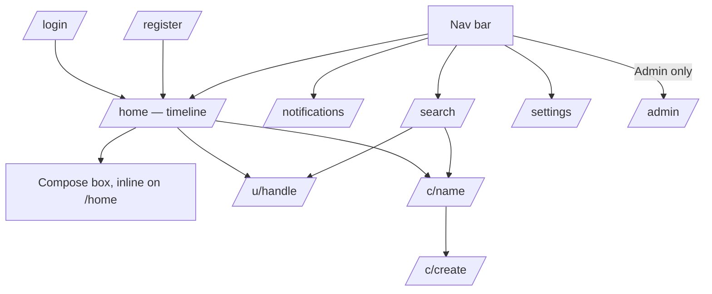

# Production App — Web Host Project Structure

> **Level 3.** Parent: [production-app-web-host.md](production-app-web-host.md). Grandparent: [production-app-overview.md](production-app-overview.md).

## 1. Project layout

```
apps/Iris.Web/
├── Iris.Web.csproj                 (net10.0, Microsoft.NET.Sdk.Web; Interactive Server components)
├── Program.cs                      (composition root — see §2)
├── appsettings.json                (defaults; no secrets)
├── appsettings.Development.json    (local dev overrides; git-ignored if it ever holds a real secret)
├── Components/
│   ├── App.razor
│   ├── Routes.razor
│   ├── Layout/
│   │   ├── MainLayout.razor        (signed-in chrome: nav, notifications badge, search box)
│   │   └── AuthLayout.razor        (login/register chrome)
│   ├── Pages/
│   │   ├── Home.razor              (route "/", redirects to /home or /login)
│   │   ├── Login.razor
│   │   ├── Register.razor
│   │   ├── Timeline.razor          (route "/home")
│   │   ├── Notifications.razor
│   │   ├── Profile.razor           (route "/u/{handle}")
│   │   ├── Community.razor         (route "/c/{name}")
│   │   ├── CommunityCreate.razor
│   │   ├── Search.razor
│   │   ├── Settings.razor
│   │   └── Admin.razor             ([Authorize(Roles="Admin")])
│   └── Shared/                     (ComposeBox, NotificationList, CollectionBrowser, ActorProfile, ObjectView, RawInspector, MediaUploader, ModerationQueue — ported/adapted from SampleBlazorClient/Components)
├── Services/
│   ├── IActorSessionAccessor.cs / ActorSessionAccessor.cs   (see production-app-web-host.md §3)
│   └── AdminBootstrapper.cs        (IHostedService: creates the first Admin account from `App:Admin:*`, see authentication doc §6)
└── wwwroot/
    └── css/app.css                 (start from the sample's app.css, iterate)
```

## 2. `Program.cs` composition order

1. `builder.Services.AddRazorComponents().AddInteractiveServerComponents();`
2. `builder.Services.AddActivityPubServer(builder.Configuration);` — unchanged library call.
3. `builder.Services.AddEntityFrameworkPersistence(builder.Configuration);` — new, see [production-app-persistence.md](production-app-persistence.md).
4. `builder.Services.AddAuthentication(CookieAuthenticationDefaults.AuthenticationScheme).AddCookie(...);` + `AddAuthorization(...)` (register the `Admin` policy) — see [production-app-authentication.md](production-app-authentication.md).
5. `builder.Services.AddScoped<IActorSessionAccessor, ActorSessionAccessor>();`
6. `builder.Services.AddHostedService<AdminBootstrapper>();`
7. Build the app.
8. `app.UseAuthentication(); app.UseAuthorization();`
9. `app.MapActivityPubEndpoints();` — unchanged library call, mounts `/ap/v1/...` + `/.well-known/...`.
10. `app.MapRazorComponents<App>().AddInteractiveServerRenderMode();`
11. On startup (before `app.Run()`), apply pending EF Core migrations (see [production-app-persistence-schema.md](production-app-persistence-schema.md) §4).

This order matters: authentication/authorization middleware must be registered before both the ActivityPub endpoints (some are owner-gated, e.g. the inbox read and the private-key-bearing actor doc) and the Razor component endpoints.

## 3. Navigation map (MVP)



## 4. Anonymous vs. authenticated surfaces

- `/login`, `/register`, a public `/u/{handle}` profile view, and a public `/c/{name}` community view are reachable without a session (mirrors how ActivityPub actor docs are public).
- Everything else (`/home`, `/notifications`, `/settings`, posting/following/liking anywhere) requires the cookie session; use `[Authorize]` on the pages/components and `AuthorizeView` for in-page conditional UI (e.g., a "Follow" button vs. nothing, when viewing your own profile).

## 5. Adapting the sample's components

When porting `SampleBlazorClient/Components/*` into `apps/Iris.Web/Components/Shared/*`, the main change needed is **removing the "which instance am I pointed at" concept** (the sample lets the operator type in an arbitrary base URL to explore any server; the product app always talks to its own, same-origin API) — replace any `InstanceBaseUrls`-style parameter with a fixed, injected base URI from configuration. Everything else (paging logic, raw object rendering, collection walking) should port with minimal change.

## 6. What "done" looks like

- Solution builds with `apps/Iris.Web` added to `Iris.slnx`.
- A fresh container serves `/login` and, after registering, redirects to a working `/home` timeline — confirmed live via MCP Playwright (functional click-through + a visual screenshot check), not an automated UI test (see [production-app-web-host.md](production-app-web-host.md) §6).
- `/ap/v1/u/{handle}` (the actor doc), `/.well-known/webfinger`, and inbox/outbox still work exactly as they do in `SampleServer` today (prove this with a port of the existing federation-oriented **integration tests** pointed at `Iris.Web`'s host, or a fresh equivalent — this is API/backend surface, so it keeps the library's normal `TestServer` convention, unlike the UI layer above).
